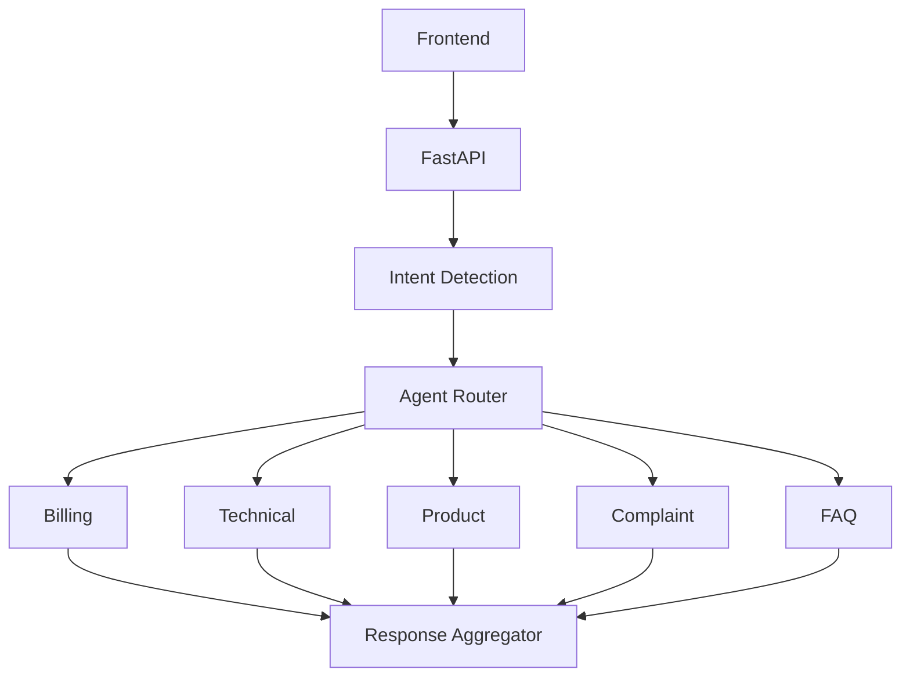

# Multi-Agent AI Customer Support Assistant

This repository contains the initial scaffold for a production-oriented multi-agent customer support platform built with:

- Next.js for the frontend
- FastAPI for the backend
- Tailwind CSS for UI styling
- TypeScript for frontend safety
- MongoDB-compatible placeholders for persistence
- Gemini-ready backend configuration for future AI integration

## Phase 1 Scope

This phase focuses on project initialization and infrastructure scaffolding only.

No authentication, agent orchestration, RAG logic, or business logic has been implemented yet.

## Project Structure

- frontend/: Next.js application shell
- backend/: FastAPI application and initial configuration
- knowledge_base/: placeholder folder for support documents
- datasets/: placeholder folder for public datasets
- scripts/: future data processing scripts

## Getting Started

### Backend

```bash
cd customer-support-ai
python3 -m venv .venv
source .venv/bin/activate
pip install -r requirements.txt
uvicorn backend.main:app --reload --host 0.0.0.0 --port 8000
```

### Frontend

```bash
cd customer-support-ai/frontend
npm install
npm run dev
```

## Environment Variables

Copy .env.example to .env and update the values before running the services.

## Phase 6A - Multi-Agent AI Foundation



### Current scope
- LangGraph-based orchestration scaffold
- Intent Detection Agent
- Specialized agents for billing, technical, product, complaint, and FAQ domains
- Agent Router with mock workflow selection
- Prompt templates for each agent
- Unit tests for agent routing and workflow response

### Not implemented yet
- Gemini integration
- RAG pipeline
- Business logic execution
- Real downstream tool calls
